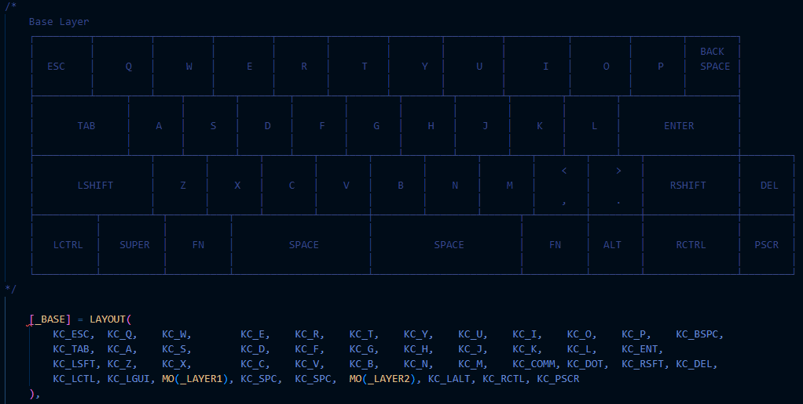

# Leaf40
This is my custom split spacebar 40% keyboard, with a custom PCB, and a 3D printed case.

***This is a work in progress, this repository houses all files pertaining to the project.***

## Parts List
- [ ] PCB
- [ ] Case
- [ ] Plate
- [ ] Keycaps
- [ ] MX-Style Switches
- [ ] SOD-123 diodes (44 total)
- [ ] Arduino Pro Micro
- [ ] Screw-in Stabilizers (2x2u)

## Layout
The layout can be found in the `Keyboard Layout` directory.

Layer 0 is the default layer, while each layer will have the corresponding layer switch keys darkened.

As of right now, non-zero layers are a ***work in progress and will change.***

## PCB
The PCB was designed on KiCad and can be found in the `PCB` directory.

MarbastLib is required to have the MX switch footprints.

## Firmware

This keyboard supports QMK and Vial. Both files can be found in the `Firmware` directory, `default` for regular QMK, and `vial` for the Vial firmware.

These firmwares can be flashed using the QMK Toolbox. 

The QMK firmware has ASCII art for the keyboard layouts, for ease of editing.

### Flashing QMK Firmware
Add the `default` keymap, info JSON, and rules file into a directory named `leaf40` under `keyboards` in your QMK directory. Then, compile using `qmk compile -kb leaf40 -km default`. Flash using QMK Toolbox.

### Flashing Vial Firmware
Add the `vial` keymap, info JSON, and rules file into a directory named `leaf40` under `keyboards` in your Vial directory. Then, compile using `make leaf40:vial` in your `vial-qmk` directory. Flash using QMK Toolbox.
